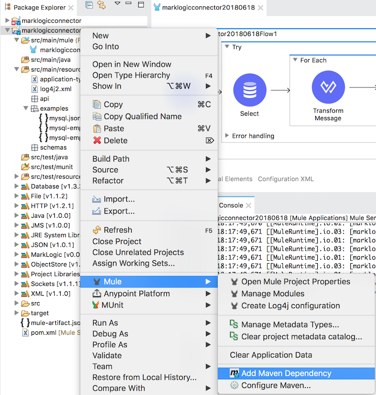

# Mulesoft Connector Extension for MarkLogic

## About the Connector


The intent of this connector is to demonstrate a Mulesoft AnypointStudio (Mulesoft's Eclipse-based graphical IDE) Flow to ingest MySQL relational database content into MarkLogic as JSON documents, much like the MarkLogic NiFi Connector does. 

Similarly to the NiFi Connector, the Mulesoft Connector is predicated on the use of the MarkLogic Data Movement SDK to communicate to MarkLogic.  

This Connector demo is built on Mule 4.1 SDK and AnypointStudio 7.1.  The genesis of the demo Connector code comes from scaffolding from a Maven archetype:

```
mvn archetype:generate
  -DarchetypeCatalog=http://repository.mulesoft.org/releases/
  -DarchetypeGroupId=org.mule.extensions
  -DarchetypeArtifactId=mule-extensions-archetype
  -DarchetypeVersion=1.1.0
  -DgroupId=com.marklogic
  -DartifactId=marklogic-mule-connector
  -Dversion=0.0.1-SNAPSHOT
  -Dpackage=com.marklogic.mule.extension.connector
  -DextensionName=MarkLogicConnector
```
This will bootstrap and auto-generate a few classes needed for a Mulesoft Connector.  It also provides a few test classes, which use Surefire for reporting.

The important classes that get generated are: 

* MarkLogicConnectionProvider: class exists to manage the connections to MarkLogic.  Works in conjunction with the MarkLogicConnection class.
* MarkLogicOperations: class defines all operations to/from MarkLogic.  Individual methods in this class become callable within Mule flows.
* MarkLogicConfiguration: class used to define all configurations and parameterization used in connections.

Once your classes are defined, build and test with `mvn clean install`.

In order to use the connector, create a new, empty Mule project in AnyStudio, and add this dependency to your application pom.xml:

```
<groupId>com.marklogic</groupId>
<artifactId>marklogic-mule-connector</artifactId>
<version>0.0.1</version>
```

To do this in the editor, use this screenshot as a guide:



Once the dependency is added, it should show up in the Mule Pallet at top right.  Operations can then be dragged to the visual flow designer for integration with other components and connectors.