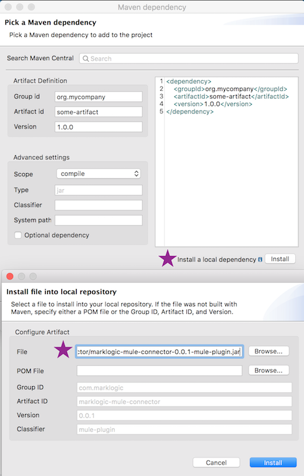
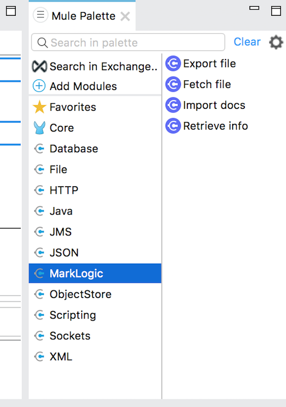

# Mulesoft Connector Extension for MarkLogic #

  
  
## About the Connector ##
------------------------

<a href="http://mulesoft.com">Mulesoft</a> is a enterprise-grade, lightweight Java <a href="https://www.mulesoft.com/resources/esb-integration">Enterprise Service Bus and Application Orchestration platform</a> that encourages an API-first approach to services, workflows, and data integration. In fact, one can even define and serve RAML-based REST APIs within Mulesoft to orchestrate data movement between flow components.

The project aims to provide the Mulesoft community of users (known as <a href="https://www.mulesoft.com/exchange/">Anypoint Exchange</a>) with a MarkLogic Connector that delivers data movement and transformation pipelines via Mulesoft <a href="https://www.mulesoft.com/platform/studio">AnypointStudio</a> Flow file.  AnypointStudio is Mulesoft's <a href="https://www.eclipse.org/">Eclipse</a>-based graphical IDE, <a href="https://www.mulesoft.com/platform/api/flow-designer-integration-tool">used to design, author, and run flows</a>. 

Despite the graphical design nature of flows in AnypointStudio, under the covers, each flow in Mule is simply an XML file defining the workflow.  If one chooses, flow authoring can be done entirely in XML, even within AnypointStudio.

Similar to the recently-developed MarkLogic NiFi Connector, the Mulesoft Connector is buit atop the MarkLogic Data Movement SDK (DMSDK), used to do all work with MarkLogic.  

This Connector demo is built on Mule 4.1 SDK and AnypointStudio 7.1.  
  
  
  
## Building the Connector ##
----------------------

*N.B.: Building the Connector is probably not necessary unless contributing to the codebase. If not, feel free to skip to "Using the Connector" below.*

The skeleton of the demo Connector code comes from scaffolding from a Maven archetype:

```
mvn archetype:generate
  -DarchetypeCatalog=http://repository.mulesoft.org/releases/
  -DarchetypeGroupId=org.mule.extensions
  -DarchetypeArtifactId=mule-extensions-archetype
  -DarchetypeVersion=1.1.0
  -DgroupId=com.marklogic
  -DartifactId=marklogic-mule-connector
  -Dversion=1.0.0
  -Dpackage=com.marklogic.mule.extension.connector
  -DextensionName=MarkLogicConnector
```
This bootstraps and auto-generates a few classes needed for a Mulesoft Connector.  It also provides a few test classes, which use Surefire for reporting.

The important classes that get generated are: 

* MarkLogicConnectionProvider: class exists to manage the connections to MarkLogic.  Works in conjunction with the MarkLogicConnection class.
* MarkLogicOperations: class defines all operations to/from MarkLogic.  Individual methods in this class become callable within Mule flows.
* MarkLogicConfiguration: class used to define all configurations and parameterization used in connections.
* MarkLogicOperationsTestCase: class used to define tests. Works in conjunction with *src/test/resources/test-mule-config.xml*.

Once your classes are defined, build and test with `mvn -X clean install`. 

Successful JAR file builds of the Connector, including generated HTML documentation for the Connector, are placed into the *target/* directory.

### Tests ###

Surefire tests defined in MarkLogicOperationsTestCase and test-mule-config.xml will run during the Maven build and install process.  If tests fail, Surfire produces plain text and XML report outputs in the *target/* directory.

There is a simple test of static JSON content for each defined operation.

### Operations ###

Current operations include:

* importDocs
  *  Used by Mule flows to ingest JSON, XML, text, or binary content into MarkLogic. Returns a DMSDK jobID.
* getJobReport
  * Use the output jobID from importDocs to return JSON object that reports the current job ID status.  At the end of the batch, this will return a JSON object based on the contents of a <a href="https://docs.marklogic.com/javadoc/client/com/marklogic/client/datamovement/JobReport.html">DMSDK JobReport</a>.  Prior to the end of the batch, the JSON object report simply echoes the jobID.
* retrieveInfo
  *  Simply echoes back Mule to MarkLogic connection information.

For each operation in the project, there are <a href="examples/">example flows</a> with documentation included.  Also included is a guide on how to build your first empty flow.

  
  
## Installing the Connector ##
-------------------------

### Installing dependencies ###

In order to use the connector, create a new, empty Mule project in AnyStudio with:

* File &rarr; New &rarr; Mule Project

You're now ready to install the Connector as a Maven dependency for your project.  Right- or Ctrl-click on your project name in the Package Explorer.

To do this in the editor, use these screenshots as a guide, making sure to add the Connector jar as a local dependency:

</img>

Use "Install a local dependency", and add the Connector .jar file from the *target/* directory on your filesystem.

</img>

You can optionally or alternatively add this dependency as an Artifact Definition:

```
<dependency>
 <groupId>com.marklogic</groupId>
  <artifactId>marklogic-mule-connector</artifactId>
  <version>1.0.0</version>
</dependency>
```

*Important Note*: You may need to install additional dependencies and update the list of Maven repositories.  For example, in the MarkLogic Java API and Data Movement SDK libraries, the current okhttp-digest library version is 1.15.  Several developers working on this project have needed to additionally include 1.16 in the Mule project dependencies while using AnypointStudio.  To find it, the JCenter repository needed adding to the pom.xml under the Mule project tree.  

```
<repository>
  <id>jcenter</id>
  <url>http://jcenter.bintray.com</url>
</repository>
```
After the repository is added, use the "Add Maven Dependency" approach as described above add okhttp-1.16 libraries (or edit the pom.xml file):

```
<dependency>
  <groupId>com.burgstaller</groupId>
  <artifactId>okhttp-digest</artifactId>
  <version>1.16</version>
</dependency>
``` 

In order to run the <a href="examples/importDocs">example importDocs flows</a>, which contains functionality that retrieves data from a MySQL database, you must add a dependency for MySQL, as it is used need for use with the Mulesoft Database Connector:

```
<dependency>
   <groupId>mysql</groupId>
   <artifactId>mysql-connector-java</artifactId>
   <version>5.1.44</version>
</dependency>
```

</img>
  
## Configuring and Using the Connector ##
--------------------------------

Once the Connector dependency is added, it should show up in the Mule Pallet at top right, as depicted below. 
  
  
</img>

Operations listed at right can then be clicked and dragged to the visual flow designer for integration with other components and connectors.  Once placed on the designer view, click the icon of the operation you selected, and begin configuring it on the tab below.


### MarkLogic Connection Parameters ###

||Parameter|Required?|Default Value (if no value provided)|Data Type|Notes and Usage|
|--- |--- |--- |--- |--- |--- |
|1|hostname|Required|localhost|String|The hostname against which operations should run.|
|2|port|Required|8010|int|The app server port against which operations should run.|
|3|database|Optional|null|String|The MarkLogic database name (i.e., xdmp:database-name()), against which operations should run.|
|4|username|Required|admin|String|The named user.|
|5|password|Required|admin|String|The named user's password.|
|6|authenticationType|Required|digest|String|Possible values are:digestbasicapplication-levelkerberos|
|7|sslContext|Optional|null|String|Currently unsupported in version 1.0.0.|
|8|kerberosExternalName|Optional|null|String|If "kerberos" is used for the authenticationType parameter, a Kerberos external name value can be supplied if needed.|
|9|connectionId|Required|testConfig-223efe|String|An identifier used for the Mulesoft Connector to keep state of its connection to MarkLogic. Also set on the Connector configuration parameters (see below).|

### Operations Configuration Parameters ###


||Parameter|Required?|Default Value (if no value provided)|Data Type|Notes and Usage|
|--- |--- |--- |--- |--- |--- |
|1|configId|Required|testConfig-223efe|String|An identifier used for the Mulesoft Connector to keep state of its connection to MarkLogic.|
|2|threadCount|Required|4|String (later cast to Integer)|The thread count passed to DMSDK, representing the number of parallel processing threads.|
|3|batchSize|Required|100|String (later cast to Integer)|The batch size passed to DMSDK, representing the number of documents processed within a batch.|
|4|outputCollections|Optional|null|String (later cast to String[] array)|A comma-separated list of collections. Inspired by MLCP usage pattern for expressing the collections where processed documents will be logically grouped.If kept as null, documents will be persisted without any collections.|
|5|outputPermissions|Optional|rest-reader,read,rest-writer,update|String (later cast to String[] array)|A comma-separated list of alternating roles and capabilities.Inspired by MLCP usage pattern for expressing document permissions.By default, DMSDK persists all documents with rest-reader read, and rest-writer update permissions. If the non-default value (over and beyond these two permissions) is provided, they are considered additive to the rest-reader read, and rest-writer update permissions.|
|6|outputQuality|Optional|1|String (later cast to Integer)|The quality to use when persisting documents.|
|7|outputUriPrefix|Optional|/mulesoft/|String|The URI prefix, used to prepend and concatenate the document basename (which is passed in as a parameter on the importDocs method).|
|8|outputUriSuffix|Optional|.json|String|The URI suffix, used to append and concatenate to the document basename (which is passed in as a parameter on the importDocs method).|
|9|generateOutputUriBasename|Optional|true|String (later cast to Boolean)|Inspired by MLCP cgenerate_uri. Creates a document basename based on a UUID, to be combined with the outputUriPrefix and outputUriSuffix, if populated.This is an alternative to having to pass in a basename parameter on the importDocs method.|
|10|serverTransform|Optional|null|String|The name of an already registered and deployed MarkLogic server-side Javascript, XQuery, or XSLT module.e.g. (for Data Hub Framework input flows):ml:sjsInputFlow (SJS)ml:inputFlow (XQuery)|
|11|serverTransformParams|Optional|null|String (later cast to String[] array)|A comma-separated list of alternating transform parameter names and transform parameter values.Inspired by MLCP usage pattern for expressing server transform parameters with command transform_param.e.g. (for Data Hub Framework input flows):entity-name,Employees,flow-name,loadEmployees|
|12|secondsBeforeWriteFlush|Optional|2|String (later cast to Integer)|The number of seconds before DMSDK automatically flushes the current batch if not yet filled to the specified batchSize configurable.|
