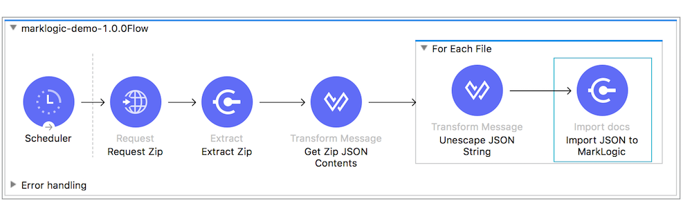
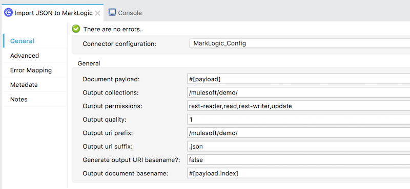
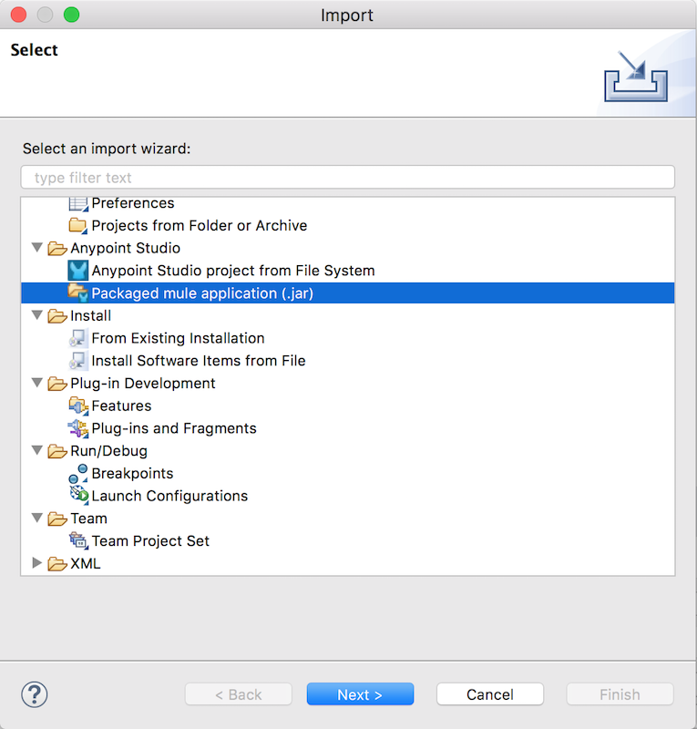
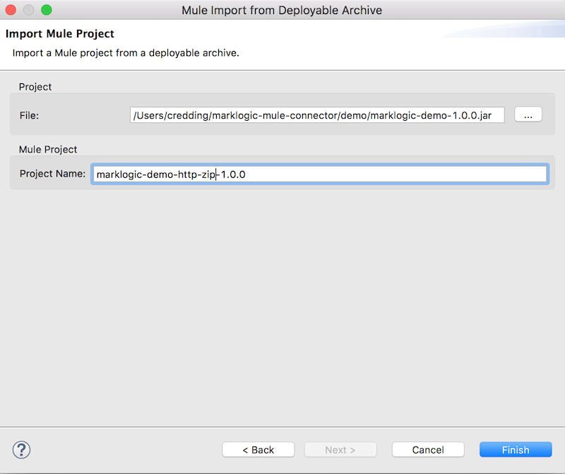

## Example: MarkLogic Mule Connector ##

This example demonstrates the use of the MarkLogic Mule Connector, doing the following:

* Fetching a zip file over HTTP GET.
* Extracting the zip, and sending the contents through to MarkLogic the importDocs operation via the Connector.



### To Configure this Example ###

The MarkLogic importDocs operation connection configuration is pre-populated.  However, should you need to tweak any settings, select the importDocs icon in the flow, and change any necessary settings.



### To Test the Example ###

* Click File &rarr; Import
* On the next screen, click "Packaged mule application (.jar)" &rarr; Next.
* You can now import the demo jar on the next screen.  Locate the demo/ directory from the codebase, and add the demo jar file. Assign the demo a project name.
* Run the project by right- or Ctrl-clicking the project name at left, the Run As &rarr; Mule Application.






### About the XML Flow ###

Create a new Mule Project and install the MarkLogic Mule Connector dependency.

* Next, right- or Ctrl-click the project at left in the Project Explorer view of Anypoint Studio. 

* Select File &rarr; New &rarr; Mule Configuration File.


* Provide a name for your Mule flow.  It will automatically populate the name of the Flow XML.


. In the main window section, find the link for "Configuration XML". Copy and paste the following into the XML editor, then save (overwriting the existing XML). 

*Note:* You'll need to update your MarkLogic credentials to write the Zip contents to your local MarkLogic.


```
<?xml version="1.0" encoding="UTF-8"?>
<mule xmlns:batch="http://www.mulesoft.org/schema/mule/batch" xmlns:file="http://www.mulesoft.org/schema/mule/file"
    xmlns:marklogic="http://www.mulesoft.org/schema/mule/marklogic"
    xmlns:ee="http://www.mulesoft.org/schema/mule/ee/core" xmlns:compression="http://www.mulesoft.org/schema/mule/compression" xmlns:http="http://www.mulesoft.org/schema/mule/http" xmlns:scripting="http://www.mulesoft.org/schema/mule/scripting" xmlns:xml-module="http://www.mulesoft.org/schema/mule/xml-module" xmlns="http://www.mulesoft.org/schema/mule/core" xmlns:doc="http://www.mulesoft.org/schema/mule/documentation" xmlns:xsi="http://www.w3.org/2001/XMLSchema-instance" xsi:schemaLocation="http://www.mulesoft.org/schema/mule/core http://www.mulesoft.org/schema/mule/core/current/mule.xsd
    http://www.mulesoft.org/schema/mule/xml-module http://www.mulesoft.org/schema/mule/xml-module/current/mule-xml-module.xsd
    http://www.mulesoft.org/schema/mule/scripting http://www.mulesoft.org/schema/mule/scripting/current/mule-scripting.xsd
    http://www.mulesoft.org/schema/mule/http http://www.mulesoft.org/schema/mule/http/current/mule-http.xsd
    http://www.mulesoft.org/schema/mule/compression http://www.mulesoft.org/schema/mule/compression/current/mule-compression.xsd
    http://www.mulesoft.org/schema/mule/ee/core http://www.mulesoft.org/schema/mule/ee/core/current/mule-ee.xsd
    http://www.mulesoft.org/schema/mule/marklogic http://www.mulesoft.org/schema/mule/marklogic/current/mule-marklogic.xsd
    http://www.mulesoft.org/schema/mule/file http://www.mulesoft.org/schema/mule/file/current/mule-file.xsd
    http://www.mulesoft.org/schema/mule/batch http://www.mulesoft.org/schema/mule/batch/current/mule-batch.xsd">
    <configuration-properties file="automation-credentials.properties"/>
	<marklogic:config name="MarkLogic_Config" doc:name="MarkLogic Config" doc:id="300595dd-bdd6-48d7-9aa6-011ff0f2a239" configId="testConfig-223efe" threadCount="4" batchSize="100" secondsBeforeFlush="2" jobName="kmlJobName" >
		<marklogic:connection hostname="${config.hostName}" port="8010" username="${config.username}" password="${config.password}" authenticationType="digest" connectionId="testConfig-223efe" />
	</marklogic:config>
    <file:config name="TmpDirFileConfig" doc:name="File Config" doc:id="59a59bab-f0b5-4b9f-80c6-82cf9f91f92e" >
        <file:connection workingDir="/tmp/" />
    </file:config>
    <http:request-config name="HTTP_Request_configuration" doc:name="HTTP Request configuration" doc:id="fe02efb9-23c0-42be-a558-16a85bd54954" >
		<http:request-connection host="${config.hostName}" port="8010" >
			<http:authentication >
				<http:digest-authentication username="${config.username}" password="${config.password}" />
			</http:authentication>
		</http:request-connection>
	</http:request-config>
    <flow name="marklogic-demo-1.0.0Flow" doc:id="5ad02de3-73ed-47ad-8b22-f6e2058796f0" >
        <scheduler doc:name="Scheduler" doc:id="78bbac91-46a4-4aeb-8b10-96f036aa5206" >
            <scheduling-strategy >
                <fixed-frequency frequency="10000"/>
            </scheduling-strategy>
        </scheduler>
        <http:request method="GET" doc:name="Request Zip" doc:id="d831298f-51b5-42f6-bc39-23dab5e5d5ca" config-ref="HTTP_Request_configuration" path="/v1/documents" target="archive">
            <http:query-params ><![CDATA[#[output applicaton/java
---
{
	"uri" : "/mulesoft/demo.zip"
}]]]></http:query-params>
        </http:request>
        <compression:extract doc:name="Extract Zip" doc:id="0f49f842-848c-4a14-b210-c7b491e72a0b" target="out">
            <compression:compressed ><![CDATA[#[vars.archive]]]></compression:compressed>
            <compression:extractor >
                <compression:zip-extractor />
            </compression:extractor>
        </compression:extract>
        <ee:transform doc:name="Get Zip JSON Contents" doc:id="ca5d9d8c-14ff-48bf-a8ff-2c309a89d2ff" >
            <ee:message >
                <ee:set-payload ><![CDATA[%dw 2.0
output application/json
---
vars.out pluck $]]></ee:set-payload>
            </ee:message>
        </ee:transform>
        <foreach doc:name="For Each File" doc:id="33e8d5ba-b23d-4677-a6ce-d17f5cd01136" collection="#[payload]">
            <ee:transform doc:name="Unescape JSON String" doc:id="0e989ad1-2abb-41b0-ad06-6930b53cc73d" >
                <ee:message >
                    <ee:set-payload ><![CDATA[%dw 2.0
output application/json
---
read(payload, "application/json")]]></ee:set-payload>
                </ee:message>
            </ee:transform>
            <marklogic:import-docs doc:name="Import JSON to MarkLogic" doc:id="d54ce4a5-a043-4013-99fe-19153e283afe" config-ref="MarkLogic_Config" docPayloads="#[payload]" outputCollections="/mulesoft/demo/" outputUriPrefix="/mulesoft/demo/" generateOutputUriBasename="false" basenameUri="#[payload.index]"/>
        </foreach>
    </flow>
</mule>
```

### See Also ###

[MarkLogic Connector Release Notes](release-notes)
