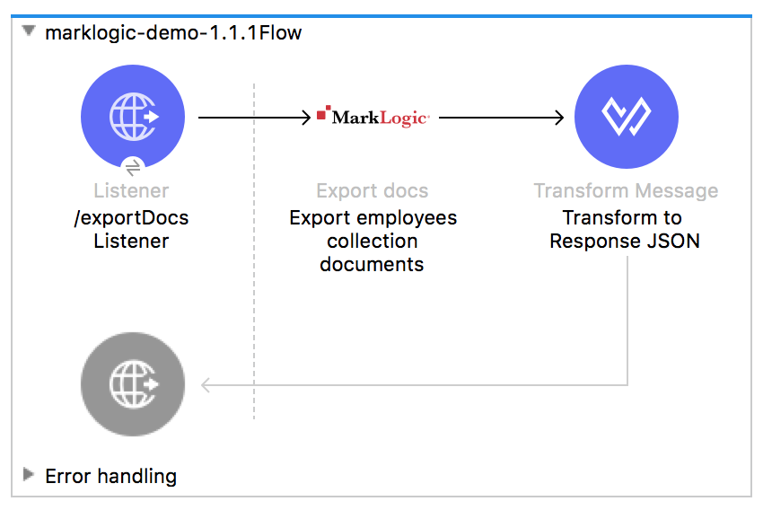
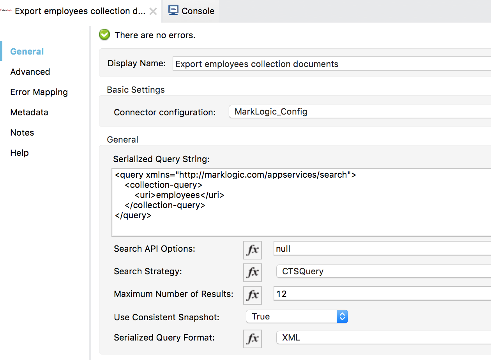
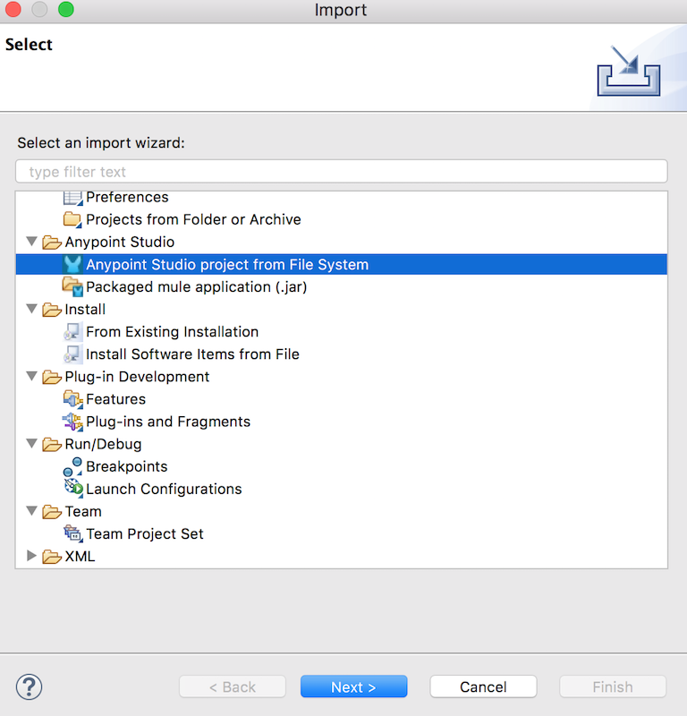
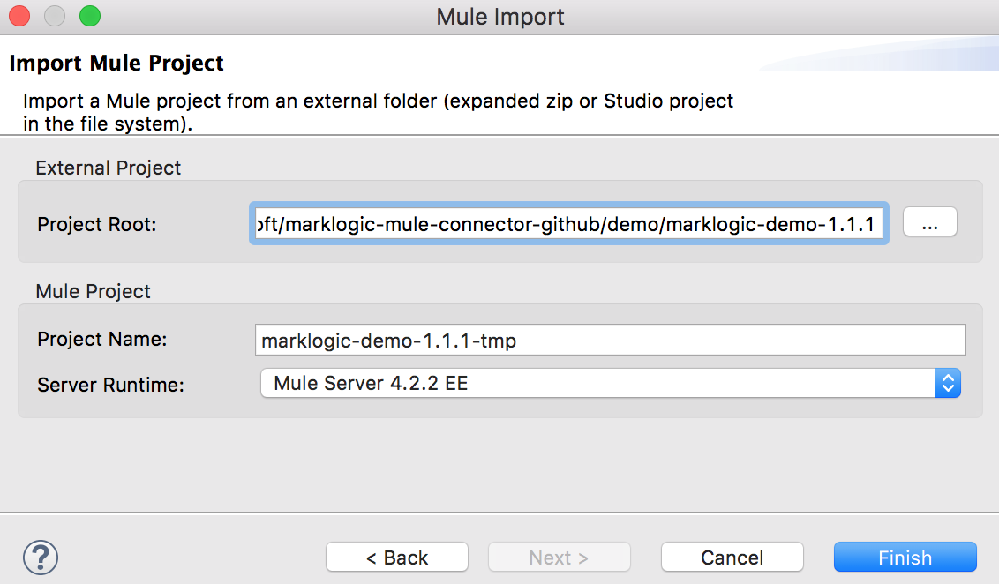
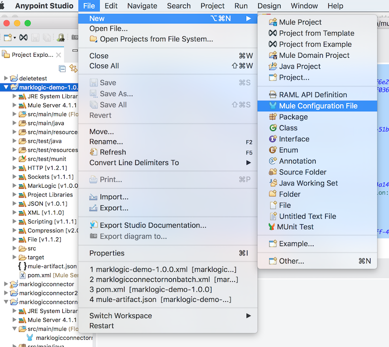
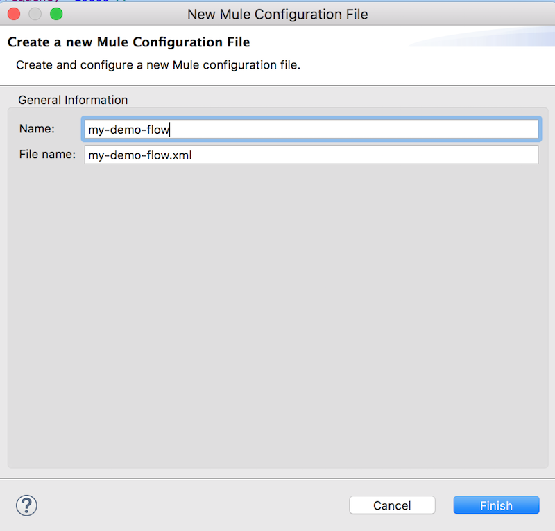
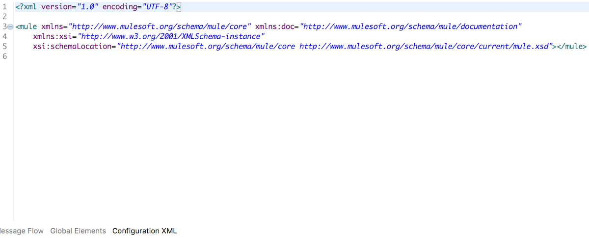

## Example: MarkLogic Mule Connector ##

This example demonstrates the query capabilities of MarkLogic Mule Connector version 1.1.1, doing the following:

* Creating a MuleSoft HTTP listener on port 8081, accepting GET requests at /exportDocs, that returns a custom JSON response payload with custom response header "X-MarKLogic-ResultCount".
* Using the MarkLogic exportDocs operation to perform a consistent snapshot query for documents within the "employees" collection, via a Structured Query.  The count of returned documents from exportDocs is limited to 12 documents.
* Transforming the output documents, formulating a custom JSON response payload containing each document, as well as showing the overall result count in the payload.
* Returning the response to the caller.

#### Flow Depiction ####



### To Configure this Example ###

#### Adding Dependencies ####

*Important Note*: For the demo application, everything should be in place to run the flow.  If you experience issues with missing dependencies, you might need to add the JCenter repository to the demo pom.xml file for fetching the MarkLogic Java API and Data Movement SDK.

```
<repository>
  <id>jcenter</id>
  <url>http://jcenter.bintray.com</url>
</repository>
```
#### Flow Operation Configuration ####

The MarkLogic exportDocs operation is pre-populated with the needed configuration.  However, should you need to tweak any settings, select the exportDocs icon in the flow, and change any necessary settings.



Also, update the automation-credentials.properties to populate username, password, host, and the file sytem location for the job report file output.


### To Test the Example ###

* Click File &rarr; Import
* On the next screen, click "Anypoint Studio project from File System" &rarr; Next.
* You can now import the demo from the file system on the next screen.  Locate the demo/ directory from the codebase, and find the 1.1.1 demo.  
* Provide a project name. Use ""Server Runtime 4.2.2 EE". 
* The project will be imported and begin to build automatically. 
* Run the project by right- or Ctrl-clicking the project name at left, the Run As &rarr; Mule Application.
* If you experience any dependency issues, you might need to add the JCenter repository to the demo project pom.xml file, as described above in "Adding Dependencies".






### About the XML Flow & Creating New Flows ###

Create a new Mule Project and install the MarkLogic Mule Connector dependency into the demo pom.xml file.

```
	<dependency>
            <groupId>com.marklogic</groupId>
            <artifactId>marklogic-mule-connector</artifactId>
            <version>1.1.1</version>
            <classifier>mule-plugin</classifier>
    </dependency>
```

Also, update the automation-credentials.properties to populate username, and password for the MarkLogic connection.

* Next, right- or Ctrl-click the project at left in the Project Explorer view of Anypoint Studio. 

* Select File &rarr; New &rarr; Mule Configuration File.



* Provide a name for your Mule flow.  It will automatically populate the name of the Flow XML.



. In the main window section, find the link for "Configuration XML". Copy and paste the following into the XML editor, then save (overwriting the existing XML).



```
<?xml version="1.0" encoding="UTF-8"?>
<mule xmlns:ee="http://www.mulesoft.org/schema/mule/ee/core" xmlns:marklogic="http://www.mulesoft.org/schema/mule/marklogic"
    xmlns:http="http://www.mulesoft.org/schema/mule/http"
    xmlns="http://www.mulesoft.org/schema/mule/core" xmlns:doc="http://www.mulesoft.org/schema/mule/documentation" xmlns:xsi="http://www.w3.org/2001/XMLSchema-instance" xsi:schemaLocation="http://www.mulesoft.org/schema/mule/core http://www.mulesoft.org/schema/mule/core/current/mule.xsd
    http://www.mulesoft.org/schema/mule/http http://www.mulesoft.org/schema/mule/http/current/mule-http.xsd
    http://www.mulesoft.org/schema/mule/marklogic http://www.mulesoft.org/schema/mule/marklogic/current/mule-marklogic.xsd
    http://www.mulesoft.org/schema/mule/ee/core http://www.mulesoft.org/schema/mule/ee/core/current/mule-ee.xsd">
    <configuration-properties file="automation-credentials.properties"/>
    <http:listener-config name="HTTP_Listener_config" doc:name="HTTP Listener config" doc:id="8b45556d-702c-49c6-bdaf-3943845bdc8e" basePath="/" >
        <http:listener-connection host="0.0.0.0" port="8081" />
    </http:listener-config>
    <marklogic:config name="MarkLogic_Config" doc:name="MarkLogic Config" doc:id="70508ab1-c787-485a-9b35-970bbfbf9208" configId="testConfig" threadCount="4" batchSize="100" secondsBeforeFlush="2" jobName="myJobName" >
        <marklogic:connection hostname="${config.hostName}" port="8010" username="${config.username}" password="${config.password}" authenticationType="digest" connectionId="testConfig" />
    </marklogic:config>
    <flow name="marklogic-demo-1.1.1Flow" doc:id="ee6da7e5-0aa3-4208-9b29-876a30707dab" >
        <http:listener doc:name="/exportDocs Listener" doc:id="e4850d1f-0bbe-41ea-97f4-ad98042690a8" config-ref="HTTP_Listener_config" path="/exportDocs">
            <http:response>
                <http:headers>
                    <![CDATA[#[output application/java
                        ---
                        {
                        	"X-MarkLogic-ResultCount" : payload.count
                        }]]]>
                </http:headers>
            </http:response>
        </http:listener>
        <marklogic:export-docs doc:name="Export employees collection documents" doc:id="d4b0b5d3-0e20-4b84-8894-fb43c1e82c22" config-ref="MarkLogic_Config" queryStrategy="CTSQuery" maxResults="12" useConsistentSnapshot="true" fmt="XML">
            <marklogic:query-string >&lt;query xmlns=&quot;http://marklogic.com/appservices/search&quot;&gt;
                &lt;collection-query&gt;
                &lt;uri&gt;employees&lt;/uri&gt;
                &lt;/collection-query&gt;
                &lt;/query&gt;</marklogic:query-string>
        </marklogic:export-docs>
        <ee:transform doc:name="Transform to  Response JSON" doc:id="826fe31b-3566-4e83-b23c-ff2c66ae7ac0" >
            <ee:message >
                <ee:set-payload >
                    <![CDATA[%dw 2.0
                        output application/json
                        ---
                        {
                        	"count": sizeOf(payload),
                        	"contents": payload
                        }
                        ]]>
                </ee:set-payload>
            </ee:message>
        </ee:transform>
    </flow>
</mule>

```

### See Also ###

[MarkLogic Connector Release Notes](release-notes)
