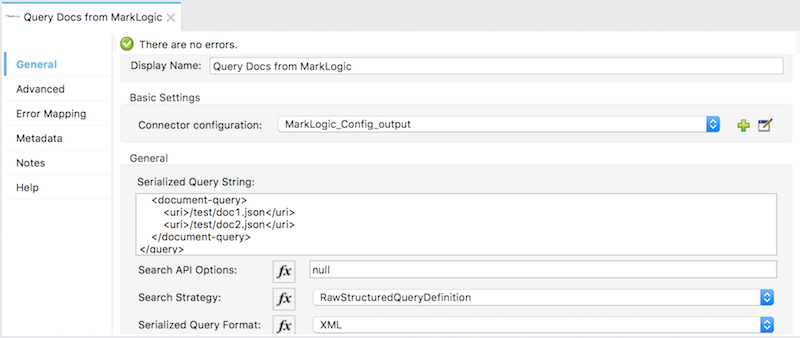
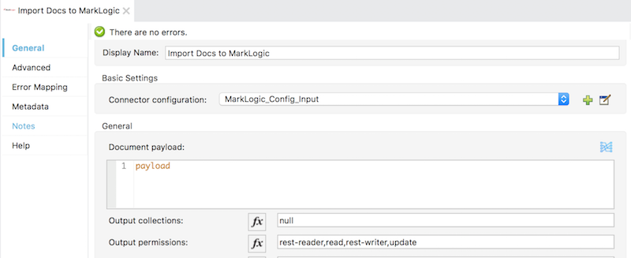
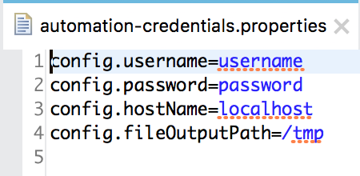
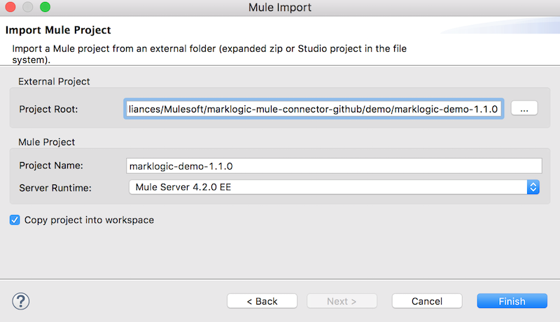

## Example: MarkLogic Mule Connector ##

This example demonstrates the query capabilities of MarkLogic Mule Connector version 1.1.0, doing the following:

* Querying for two known documents in MarkLogic, via a Structured Query.
* Transforming each, enriching the JSON with some updated properties.
* Ingesting the updated contents back into MarkLogic using new URIs.
* Writing out a batch report that details the outcome of the batch job to the filesystem.

#### Flow Depiction ####


### To Configure this Example ###

#### Adding Dependencies ####

*Important Note*: For the demo application, you'll need to add the JCenter repository to the demo pom.xml file, as it is needed for the MarkLogic Java API and Data Movement SDK.

```
<repository>
  <id>jcenter</id>
  <url>http://jcenter.bintray.com</url>
</repository>
```

The MarkLogic queryDocs and importDocs operations are pre-populated.  However, should you need to tweak any settings, select the importDocs icon in the flow, and change any necessary settings.





Also, update the automation-credentials.properties to populate username, password, host, and the file sytem location for the job report file output.



### To Test the Example ###

* Click File &rarr; Import
* On the next screen, click "Anypoint Studio project from File System" &rarr; Next.
* You can now import the demo from the file system on the next screen.  Locate the demo/ directory from the codebase, and provide a project name. Use ""Server Runtime 4.2.0 EE". 
* The project will be imported and begin to build automatically. You'll need to add the JCenter repository to the demo project pom.xml file, as described above in "Adding Dependencies".
* Run the project by right- or Ctrl-clicking the project name at left, the Run As &rarr; Mule Application.





### About the XML Flow & Creating New Flows ###

Create a new Mule Project and install the MarkLogic Mule Connector dependency into the demo pom.xml file.

```
	<dependency>
            <groupId>com.marklogic</groupId>
            <artifactId>marklogic-mule-connector</artifactId>
            <version>1.1.0</version>
            <classifier>mule-plugin</classifier>
    </dependency>
```

Also, update the automation-credentials.properties to populate username, password, host, and the file sytem location for the job report file output.

* Next, right- or Ctrl-click the project at left in the Project Explorer view of Anypoint Studio. 

* Select File &rarr; New &rarr; Mule Configuration File.


* Provide a name for your Mule flow.  It will automatically populate the name of the Flow XML.


. In the main window section, find the link for "Configuration XML". Copy and paste the following into the XML editor, then save (overwriting the existing XML).


```
<?xml version="1.0" encoding="UTF-8"?>
<mule xmlns:tracking="http://www.mulesoft.org/schema/mule/ee/tracking" xmlns:scripting="http://www.mulesoft.org/schema/mule/scripting"
    xmlns:batch="http://www.mulesoft.org/schema/mule/batch"
    xmlns:java="http://www.mulesoft.org/schema/mule/java" xmlns:http="http://www.mulesoft.org/schema/mule/http" xmlns:file="http://www.mulesoft.org/schema/mule/file" xmlns:ee="http://www.mulesoft.org/schema/mule/ee/core" xmlns:db="http://www.mulesoft.org/schema/mule/db" xmlns:marklogic="http://www.mulesoft.org/schema/mule/marklogic" xmlns="http://www.mulesoft.org/schema/mule/core" xmlns:doc="http://www.mulesoft.org/schema/mule/documentation" xmlns:xsi="http://www.w3.org/2001/XMLSchema-instance" xsi:schemaLocation="http://www.mulesoft.org/schema/mule/core http://www.mulesoft.org/schema/mule/core/current/mule.xsd
    http://www.mulesoft.org/schema/mule/marklogic http://www.mulesoft.org/schema/mule/marklogic/current/mule-marklogic.xsd
    http://www.mulesoft.org/schema/mule/db http://www.mulesoft.org/schema/mule/db/current/mule-db.xsd
    http://www.mulesoft.org/schema/mule/ee/core http://www.mulesoft.org/schema/mule/ee/core/current/mule-ee.xsd
    http://www.mulesoft.org/schema/mule/file http://www.mulesoft.org/schema/mule/file/current/mule-file.xsd
    http://www.mulesoft.org/schema/mule/http http://www.mulesoft.org/schema/mule/http/current/mule-http.xsd
    http://www.mulesoft.org/schema/mule/java http://www.mulesoft.org/schema/mule/java/current/mule-java.xsd
    http://www.mulesoft.org/schema/mule/batch http://www.mulesoft.org/schema/mule/batch/current/mule-batch.xsd
    http://www.mulesoft.org/schema/mule/scripting http://www.mulesoft.org/schema/mule/scripting/current/mule-scripting.xsd
    http://www.mulesoft.org/schema/mule/ee/tracking http://www.mulesoft.org/schema/mule/ee/tracking/current/mule-tracking-ee.xsd">
    
    <configuration-properties file="automation-credentials.properties"/>
    
    <marklogic:config name="MarkLogic_Config_output" doc:name="MarkLogic Config" doc:id="f3b284d9-e242-4b5d-ac69-71c4e2bfd5b4" threadCount="3" configId="MLConfig 1" batchSize="5" secondsBeforeFlush="5" jobName="test">
        <marklogic:connection hostname="${config.hostName}" username="${config.username}" password="${config.password}" port="8010" authenticationType="digest" connectionId="testconfig_output"/>
    </marklogic:config>
    <file:config name="File_Config" doc:name="File Config" doc:id="21c74dbd-2f23-4e58-aa7d-e89681507622" >
        <file:connection workingDir="${config.fileOutputPath}" />
    </file:config>
    <marklogic:config name="MarkLogic_Config_Input" doc:name="MarkLogic Config" doc:id="7ea07ecd-9903-46c9-b55f-4f06ac950bdb" configId="testConfig-Input" threadCount="4" batchSize="100" secondsBeforeFlush="2" jobName="myJobName">
        <marklogic:connection hostname="${config.hostName}" username="${config.username}" password="${config.password}" port="8010" authenticationType="digest" connectionId="testConfig-Input" />
    </marklogic:config>
    <flow name="marklogic-demo-1.1.0Flow" doc:id="34e694f0-e476-4211-8264-6fa86177ec06" initialState="started">
        <scheduler doc:name="Scheduler" doc:id="987eec49-1d3b-4ad8-aa00-1ed80110ea9d" >
            <scheduling-strategy >
                <fixed-frequency frequency="30000"/>
            </scheduling-strategy>
        </scheduler>
        <marklogic:query-docs doc:name="Query Docs from MarkLogic" doc:id="0127ec6f-e301-4c00-ab91-75fec3179539" config-ref="MarkLogic_Config_output" queryStrategy="RawStructuredQueryDefinition" fmt="XML">
            <marklogic:query-string>&lt;query xmlns=&quot;http://marklogic.com/appservices/search&quot;&gt;
                &lt;document-query&gt;
                &lt;uri&gt;/test/doc1.json&lt;/uri&gt;
                &lt;uri&gt;/test/doc2.json&lt;/uri&gt;
                &lt;/document-query&gt;
                &lt;/query&gt;</marklogic:query-string>
        </marklogic:query-docs>
        <batch:job jobName="marklogic-demo-1.0.0FlowBatch_Job" doc:id="3cbf8678-4b78-4551-a3d2-584a07485fae">
            <batch:process-records >
                <batch:step name="Batch_Step" doc:id="73894981-84f0-4891-88bf-dd4892e078a6" acceptPolicy="ALL">
                    <ee:transform doc:name="Transform JSON Output" doc:id="c1c7c94e-2a1c-4006-bc90-213aed384f31">
                        <ee:message>
                            <ee:set-payload><![CDATA[%dw 2.0
output application/json
---
{employeeWrap: {
	employee: {
		employeeNumber: payload.emp_no,
		hireDate: payload.hire_date,
		firstName: payload.name.first,
		lastName: payload.name.last,
		favoriteColor: payload.favorite_colors[0],
		birthDate: payload.birth_date,
		gender: payload.gender,
		extractedDateTime: now()
	}
  }
}]]></ee:set-payload>
                        </ee:message>
                    </ee:transform>
                    <batch:aggregator doc:name="Batch Aggregator" doc:id="d96ffb65-6ff1-43ff-b0ca-ab5d1365f8f0" streaming="true">
                        <foreach doc:name="For Each" doc:id="a4a96950-e5d3-4211-9923-113537ebbb69" >
                            <ee:transform doc:name="Transform JSON to JSON Object" doc:id="b431d569-1e5d-48b4-abda-b15750e4b956">
                                <ee:message>
                                    <ee:set-payload><![CDATA[%dw 2.0
output application/json
---
payload.employeeWrap]]></ee:set-payload>
                                </ee:message>
                            </ee:transform>
                            <set-payload value="#[payload]" doc:name="Set Payload" doc:id="84f9a0b7-cc88-401c-85b6-9618da001863" encoding="UTF-8" mimeType="text/json" />
                            <marklogic:import-docs doc:name="Import Docs to MarkLogic" doc:id="fcce1b32-6bcb-40ae-ba07-4fff81e3342e" config-ref="MarkLogic_Config_Input" basenameUri="#[payload.employee.employeeNumber]" outputUriPrefix="/marklogic-mulesoft-export/" generateOutputUriBasename="false"/>
                        </foreach>
                    </batch:aggregator>
                </batch:step>
            </batch:process-records>
            <batch:on-complete>
                <ee:transform doc:name="Transform Message" doc:id="84d746d6-ad8b-4b06-8d3b-77df65bf66df" >
                    <ee:message>
                        <ee:set-payload><![CDATA[%dw 2.0
output application/json
---
payload]]></ee:set-payload>
                    </ee:message>
                </ee:transform>
                <file:write doc:name="Write Output to Filesystem" doc:id="7ba9cdf3-f052-4865-ae11-e12569b22905" config-ref="File_Config" path="marklogic_mule_out.txt"/>
            </batch:on-complete>
        </batch:job>
    </flow>
</mule>
```

### See Also ###

[MarkLogic Connector Release Notes](release-notes)
