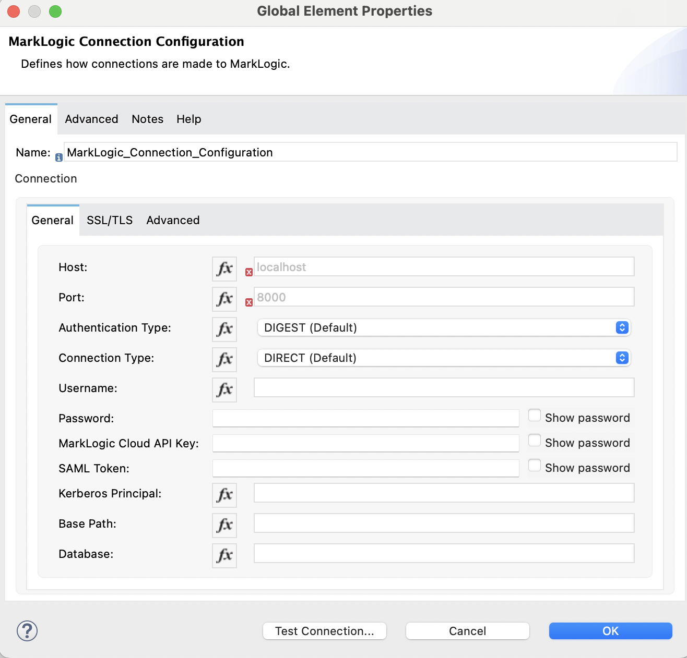

Before using any of the connector's operation, you must first configure a connection to MarkLogic. The connector 
depends on the [MarkLogic REST API](https://docs.marklogic.com/guide/rest-dev), and thus you must first have a REST API
app server in MarkLogic. 

Follow these steps to configure a connection in Anypoint Studio:

1. In your flow view, click on "Global Elements".
2. Click on "Create" in the "Global Configuration Elements" panel that Anypoint displays. 
3. Expand "Connector Configuration" and select "MarkLogic Connection Configuration".

Anypoint will display the following form for configuring a connection:

You can choose any name you wish for the connection. You can then configure each of the fields in the "General" tab 
to define how connections are made to your MarkLogic REST API app server. Upon clicking into each text field, 
Anypoint will display a small information icon to the left of the field. You can hover over this to view a 
description of the text field. For dropdown fields, you can hover over the dropdown to view a description of the field.

If your [MarkLogic app server requires an SSL connection](https://docs.marklogic.com/11.0/guide/security-guide/en/configuring-ssl-on-app-servers.html),
use the "SSL/TLS" tab to configure how the connection is made. The fields you need to configure for a Mule "TLS Context"
depend on your requirements:

1. For a "1-way" SSL connection, you must configure a trust store that allows the connector to trust the certificate 
used by your MarkLogic app server. Note that selecting "insecure" disables this feature but is not recommended for 
production usage.
2. For a "2-way" SSL connection, where the connector must present its own certificate to MarkLogic, you must configure
a key store that contains a certificate that will be trusted by your MarkLogic app server. 

After configuring your connection, you can use the "Test Connection" button in Anypoint to verify that a connection
can be created successfully. 