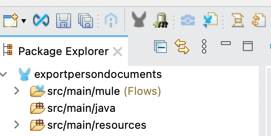

In order to use the MarkLogic Connector in an Anypoint project, you must add the connector to the project.
This can be accomplished using the built-in assistant, which will find the connector in Anypoint Exchange and then add
it to your project. Once the MarkLogic Connector has been successfully added to the Anypoint project, "MarkLogic"
will appear as a module in the Mule Palette.

Installing from Anypoint Exchange:
1. Open Anypoint Exchange by clicking on the "Open Exchange" icon near the top-left of the window.
2. If necessary, login with your Anypoint credentials.
3. Search for "marklogic".
4. Choose the "MarkLogic Connector - Mule 4" box.
5. Click on "Add to project".
6. When asked if you wish to proceed, click on "Proceed".
