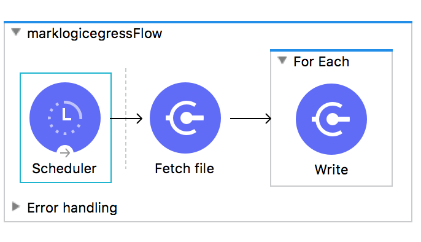

# Mulesoft Connector Extension for MarkLogic #

## Example Flow: fetchFile ##
_____________

### Overview ###

This flow demonstrates the fetchFile operation, which has the following capabilities and constraints:

* Used to export content from MarkLogic via Data Movement SDK (DMSDK) and REST.
* Support for XML, JSON, Text, and Binary.  
* Uses a ```whereMethod``` input param with value options:
  * Collections
  * UriPattern
  * Uris
  * UrisQuery
* Uses a ```where``` input param to specify the collection or URIs to export.
  * e.g.: "mulesoft-dmsdk-test"(Collections) or "/mulesoft/*" (UriPattern)
* No support yet for cts:query()-based export.
* No support yet for export of RDF graph data to a common RDF serialization.
* No support yet for server-side transforms or redaction.
* No support for compression to zip, tar, etc, as these could be handled downstream with Mulesoft connector components.

### Flow Goals ###

1. Every 1000 seconds, export documents from the mulesoft-dmsdk-test collection in MarkLogic.
2. For each file, write it to disk, using a pattern like: ```/tmp/{counter}.xml``` or ```/tmp/{counter}.json```.

### Flow Steps ###

Here's what happens in the fetchFile example flow:

* We use the built-in core Mulesoft Scheduler endpoint to kickoff the job.  
  * The Scheduler is set to run every 1000 seconds (1 million milliseconds) on a fixed frequency.
  * We could alternatively use a REST service endpoint, but just use a simple Scheduler for now.
* We then use the fetchFile operation from the MarkLogic Connector.
  * Our ```whereMethod``` is "Collections"
  * Our ```where``` is the collection "mulesoft-dmsdk-test".  This will return all documents stored in MarkLogic with collection membership of "mulesoft-dmsdk-test".
* The built-in core Mulesoft For-Each scope is used to do take each file in the output from MarkLogic. 
  * The For-Each scope, by default, chunks into a batch size of 1.  It also sets a Mule variable, which acts as an iterator, called "counter".  It's addressable downstream with ```#[vars.counter]```.
  * For each file, we then:
    *  Grab the ```#[payload]``` of each file.  This represents the file output from MarkLogic itself.  They payload -- whether XML, JSON, or other -- is standard Mule syntax and in our case is what comes back over the wire back from DMSDK.
    *  Use the built-in core Mulesoft File Write operation to write each file ```#[payload]``` to ```/tmp/{counter}.xml```.  We achieve this with the pattern: ```#[vars.counter ++ '.xml']```
  
### Flow Designer Depiction ###

</img>

### Flow XML ###

Here is the Flow XML, also available <a href="project-fetchFile-flow.xml">here</a>:


```
<?xml version="1.0" encoding="UTF-8"?>
<mule xmlns:ee="http://www.mulesoft.org/schema/mule/ee/core" xmlns:file="http://www.mulesoft.org/schema/mule/file"
    xmlns:marklogic="http://www.mulesoft.org/schema/mule/marklogic"
    xmlns="http://www.mulesoft.org/schema/mule/core" xmlns:doc="http://www.mulesoft.org/schema/mule/documentation" xmlns:xsi="http://www.w3.org/2001/XMLSchema-instance" xsi:schemaLocation="http://www.mulesoft.org/schema/mule/core http://www.mulesoft.org/schema/mule/core/current/mule.xsd
    http://www.mulesoft.org/schema/mule/marklogic http://www.mulesoft.org/schema/mule/marklogic/current/mule-marklogic.xsd
    http://www.mulesoft.org/schema/mule/file http://www.mulesoft.org/schema/mule/file/current/mule-file.xsd
    http://www.mulesoft.org/schema/mule/ee/core http://www.mulesoft.org/schema/mule/ee/core/current/mule-ee.xsd">
    <marklogic:config name="MarkLogic_Config" doc:name="MarkLogic Config" doc:id="787ed86c-be5d-4d1e-b8d5-db768f814509" configId="testConfig-223efe" threadCount="3" batchSize="5" outputCollections="mulesoft-dmsdk-test" outputPermissions="xpl-content-read,read,xpl-content-write,update" outputQuality="1" format="json" outputUriPrefix="/mulesoft/" outputUriSuffix=".json" generateOutputUriBasename="false">
        <marklogic:connection hostname="***REMOVED***" username="mulesoft" password="***REMOVED***" port="8011" />
    </marklogic:config>
    <file:config name="File_Config" doc:name="File Config" doc:id="a92a7332-0064-44b8-a355-8dfe29c1ae9b" >
        <file:connection workingDir="/tmp/" />
    </file:config>
    <flow name="marklogicegressFlow" doc:id="3be03fb0-645b-4ae0-ac9d-e4171af94e84" >
        <scheduler doc:name="Scheduler" doc:id="66d6e4a2-d158-4f39-a73f-08bd755468fd" >
            <scheduling-strategy >
                <fixed-frequency frequency="10000"/>
            </scheduling-strategy>
        </scheduler>
        <marklogic:fetch-file doc:name="Fetch file" doc:id="4e143dc7-b491-469f-bd99-042ad154c29c" config-ref="MarkLogic_Config" whereMethod="Collections" where="mulesoft-dmsdk-test"/>
        <foreach doc:name="For Each" doc:id="be55b034-0b53-4fe5-aee0-5747d0f1b49d">
            <file:write doc:name="Write" doc:id="48204f01-5c7b-4513-b085-60890b837aa2" config-ref="File_Config" path="#[vars.counter ++ '.xml']"/>
        </foreach>
    </flow>
</mule>
```