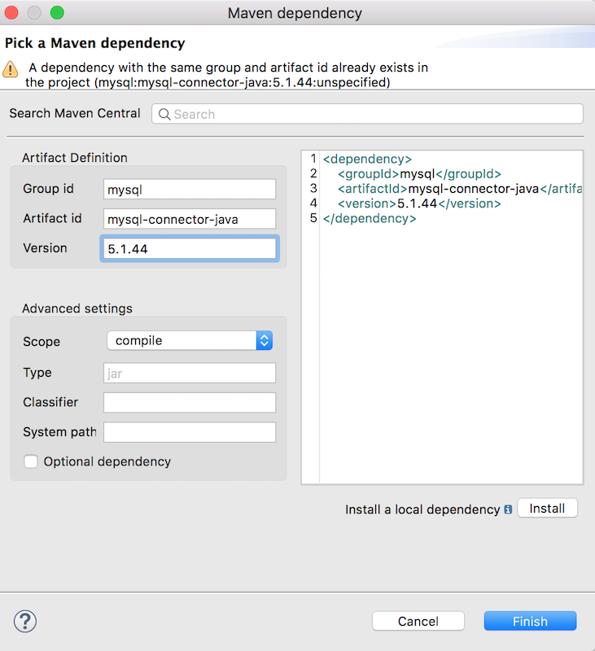

# Mulesoft Connector Extension for MarkLogic #

## Example Flows: importDocs ##

### Overview ###

Within this directory, there are two example flows of the ```importDocs``` operation.  

As you probably know by now, importDocs is used to put document content into MarkLogic, via DMSDK.  From the 10,000 foot perspective, they achieve the same thing: get data out of a relational database, transform it, and put it into MarkLogic.  However, the paths they take to get there are very different.  The two examples are used to show the flexibility of Mulesoft in preparing content for MarkLogic ingest, and the flexibility of the MarkLogic connector for accepting different document types seamlessly.

The two approaches are:

* <a href="batch/">importDocs Batch</a> (which uses JSON as the main data model)
  * Uses the built-in <a href="https://docs.mulesoft.com/mule-runtime/4.1/batch-processing-concept">Mulesoft Batch</a> capabilities to parallelize the work, with a for-each block to process individual contents. 
* <a href="non-batch/">importDocs Non-Batch</a> (which uses XML instead of JSON)
  *  Works single-threaded with a for-each block to process individual contents. 

### Useful Patterns ###

As you work through the examples, here are some useful patterns to follow within Mulesoft operations, and take note of how they work:

1. When using Mulesoft's Batch processing, it's a good idea to keep its batch sizes in sync with the importDocs/DMSDK batch sizes.
2. Within Batch processing steps, for-each blocks are useful for working with per-document contents and values.
3. MIME Types are very important. They are used in both "Set Payload" and in "Transform Message" core Mulesoft operations with major effect.  If you're working with JSON, be sure to set ```"application/json"``` in your operations.  If you're working with XML, use ```"application/xml"``` or ```"text/xml"```.  Accordingly, in the MarkLogic importDocs operation, set the corresponding file extension in "outputUriSuffix" to keep in tune with your MIME Type.
4. <a href="https://docs.mulesoft.com/mule-runtime/4.1/intro-expressions">Dataweave 2.0</a> is Mulesoft's Domain-Specific Language used in Transform Message, and it's used to set payloads, variables, filenames, etc. It's used throughout the examples: look for references to ```#[payload]``` or simply ```payload``` throughout.

### Dependencies ###


In order to run the example importDocs flows, which contains functionality that retrieves data from a MySQL database, you must add a dependency for MySQL, as it is used need for use with the MuleSoft Database Connector:

```
<dependency>
   <groupId>mysql</groupId>
   <artifactId>mysql-connector-java</artifactId>
   <version>5.1.44</version>
</dependency>
```

</img>


