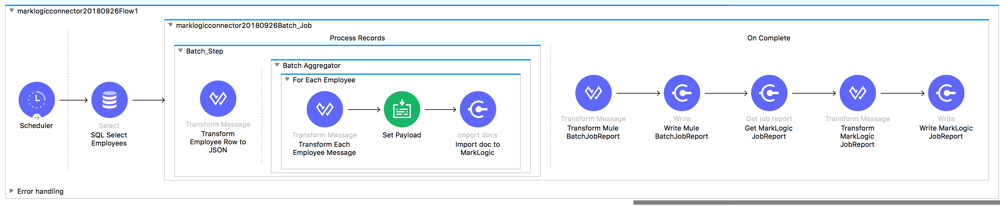

# Mulesoft Connector Extension for MarkLogic #

## Example Flow: importDocs (using Batch) ##
_____________

### Overview ###

This flow demonstrates the importDocs operation, which has the following capabilities and constraints:

* Used to import content into MarkLogic via Data Movement SDK (DMSDK) and REST.
* Support for XML, JSON.  Text and Binary are supported too, if content bypasses any use of Mulesoft's Transform Message (Dataweave) transformers.  
* Support for the usual settings on MarkLogic's xdmp:document-insert() function: collections, permissions, quality, etc.  
* Persistence URIs can be customized, or have generated URI outputs.
* Support for server-side transforms.
* Returns a jobID, used to be able to fetch per-job reporting via the getJobReport operation.
* No support yet for ingest of RDF triples in common RDF serializations. 

### Flow Goals ###

1. Periodically make a call SQL SELECT call to a MySQL relational database to get a set of row data, for eventual ingestion into MarkLogic. 
2. Using batch, in parallel threads and batches, transform the row data to JSON.
3. For each row, run it through the MarkLogic importDocs operation, to a DMSDK WriteBatch queue for asynchronous write into MarkLogic.  
4. Finally, get the binary Mulesoft BatchJobReport, convert it to JSON, and write it to our local filesystem as well. Also, we're going to get a report of our DMSDK batch job, and write that out to our local filesystem.

### Flow Dependencies ###

In order to run this flow, which contains functionality that retrieves data from a MySQL database, you must add a dependency for MySQL, as it is used need for use with the Mulesoft Database Connector:

```
<dependency>
   <groupId>mysql</groupId>
   <artifactId>mysql-connector-java</artifactId>
   <version>5.1.44</version>
</dependency>
```

</img>


### Flow Steps ###

Here's what happens in the importDocs (using batch) example flow:

* Every 30 seconds, make a call SQL SELECT call to a MySQL relational database called "employees", that is <a href="https://github.com/datacharmer/test_db">storing human resources-related employee data</a>, and return those rows.  
  * We specifically use the employees table within the employees database, calling ```select * from employees```.  
  * The columns returned are *emp_no*, *birth_date*, *first_name*, *last_name*, *gender*, and *hire_date*.
* To keep our results small for now, the Mulesoft Database Connector will return 5 rows at a time, up to a maximum of 500 rows of data.
* The returned rows are then sent into a Mulesoft Batch Job. The batch job uses the default batch size of 100 records.
  * We define a single batch step to process the records, which contains our batch workflow pipeline.  
  * The key processing step uses a Dataweave 2.0 transform, via the Mulesoft Transform Message Component, to convert each row of data returned from our SQL SELECT call into a JSON object (with JSON-friendly, human-readable property names) representing the columns mentioned above.  We add some additional structure, nesting the object in an outer *employeeWrap* object , and add an *extractedDateTime* property.  See "Initial row-to-JSON employee transform" below.
  * Then, we use a streaming batch aggregator to aggregate and prepare all of our transformed JSON objects for ingestion into MarkLogic.
  * We use a Mulesoft For-Each scope to take each aggregated record, Dataweave transform the data again to strip the *employeeWrap* object, yielding an outermost *employee* object.  See "Batch aggregator for-each employee transform" below.
  * We use the Mulesoft Set Payload transformer to set the output of the transform as the payload for the importDocs operation. 
    * *N.B.: Be sure to set the "Encoding" to "ISO 10646/Unicode" (UTF-8), and the "MIME Type" "to "application/json"*
  * The importDocs operation begins.  This uses DMSDK, with the user-defined settings for batch size and thread count.  
    *  *N.B.: It is advisable to keep the Mule batch block size in step with the MarkLogic DMSDK batch size, but not required.*
    * Since we're working with JSON in this flow, make sure to set the *outputUriSuffix* to *".json"*.  This actually helps DMSDK under the covers determine file type.
* We set our *Doc payloads* parameter with ```#[payload]```, and our *Basename uri* with ```#[payload.employee.employeeNumber]```, which gives us a good unique identifier for setting the persistent basename URI when we write to MarkLogic.
* In the Mulesoft batch job On Complete phase, we'll similarly log out its status report, called BatchJobReport.  The Mulesoft BatchJobReport is binary, so in order to effectively log it in such a way that is readable, we make use of another DataWeave transform.  See "payload" below.  We then write out the ```#[payload]``` to "marklogic_mule_out.json".      
* Also in the On Complete phase, we can run the MarkLogic operation getJobReport to get a JSON report of the current job status.  We add a transform to do a bit more enhancement of the JSON to prepare it for writing to the file system.  Finally, we write the enhanced JobReport JSON out to our filesystem, based on the UUID we added to the data.  Notice the naming of the file, performing string concatenation for our final filename: ```#[payload.uuid ++ '.json']```
 See "DMSDK JobReport Transform" below.

### Dataweave Transforms ###

#### Initial row-to-JSON employee transform ####
```
%dw 2.0
output application/json
---
{employeeWrap: {
	employee: {
		employeeNumber: payload.emp_no,
		hireDate: payload.hire_date,
		firstName: payload.first_name,
		lastName: payload.last_name,
		birthDate: payload.birth_date,
		gender: payload.gender,
		extractedDateTime: now()
	}	
  }
}
```

#### Batch aggregator for-each employee transform ####
```
%dw 2.0
output application/json
---
payload.employeeWrap
```

#### Mulesoft Batch Job On Complete Transform ####
```
%dw 2.0
output application/json
---
payload
```

#### DMSDK JobReport Transform ####
```
%dw 2.0
output application/json
---
{
	outcome: payload, 
	jobID: payload.importResults.jobName, 
	time: now(), 
	uuid: uuid()
}
```

### Flow Designer Depiction ###

</img>

### Flow XML ###

Here is the Flow XML, also available <a href="project-mysql-importDocs-batch-flow.xml">here</a>:


```
<?xml version="1.0" encoding="UTF-8"?>
<mule xmlns:tracking="http://www.mulesoft.org/schema/mule/ee/tracking" xmlns:scripting="http://www.mulesoft.org/schema/mule/scripting"
    xmlns:batch="http://www.mulesoft.org/schema/mule/batch"
    xmlns:java="http://www.mulesoft.org/schema/mule/java" xmlns:http="http://www.mulesoft.org/schema/mule/http" xmlns:file="http://www.mulesoft.org/schema/mule/file" xmlns:ee="http://www.mulesoft.org/schema/mule/ee/core" xmlns:db="http://www.mulesoft.org/schema/mule/db" xmlns:marklogic="http://www.mulesoft.org/schema/mule/marklogic" xmlns="http://www.mulesoft.org/schema/mule/core" xmlns:doc="http://www.mulesoft.org/schema/mule/documentation" xmlns:xsi="http://www.w3.org/2001/XMLSchema-instance" xsi:schemaLocation="http://www.mulesoft.org/schema/mule/core http://www.mulesoft.org/schema/mule/core/current/mule.xsd
    http://www.mulesoft.org/schema/mule/marklogic http://www.mulesoft.org/schema/mule/marklogic/current/mule-marklogic.xsd
    http://www.mulesoft.org/schema/mule/db http://www.mulesoft.org/schema/mule/db/current/mule-db.xsd
    http://www.mulesoft.org/schema/mule/ee/core http://www.mulesoft.org/schema/mule/ee/core/current/mule-ee.xsd
    http://www.mulesoft.org/schema/mule/file http://www.mulesoft.org/schema/mule/file/current/mule-file.xsd
    http://www.mulesoft.org/schema/mule/http http://www.mulesoft.org/schema/mule/http/current/mule-http.xsd
    http://www.mulesoft.org/schema/mule/java http://www.mulesoft.org/schema/mule/java/current/mule-java.xsd
    http://www.mulesoft.org/schema/mule/batch http://www.mulesoft.org/schema/mule/batch/current/mule-batch.xsd
    http://www.mulesoft.org/schema/mule/scripting http://www.mulesoft.org/schema/mule/scripting/current/mule-scripting.xsd
    http://www.mulesoft.org/schema/mule/ee/tracking http://www.mulesoft.org/schema/mule/ee/tracking/current/mule-tracking-ee.xsd">
    <marklogic:config name="MarkLogic_Config" doc:name="MarkLogic Config" doc:id="787ed86c-be5d-4d1e-b8d5-db768f814509" threadCount="3" batchSize="5" secondsBeforeFlush="2" jobName="import" configId="testConfig-223efe">
        <marklogic:connection hostname="***REMOVED***" username="mulesoft" password="***REMOVED***" port="8010" authenticationType="digest" connectionId="testConfig-223efe"/>
    </marklogic:config>
    <db:config name="Database_Config" doc:name="Database_Config" doc:id="e81f7b60-a562-4e53-afaa-bcf4e7769ed1" >
        <db:my-sql-connection host="***REMOVED***" port="3306" user="mulesoft" password="***REMOVED***" database="employees" >
            <db:column-types />
        </db:my-sql-connection>
    </db:config>
    <file:config name="File_Config" doc:name="File Config" doc:id="940e2b10-0c27-49f2-8695-65ea0cdbf474" >
        <file:connection workingDir="/tmp" />
    </file:config>
    <flow name="marklogicconnector20180926Flow1" doc:id="52e50d2e-ea57-4f04-a62a-78777e15b6eb" initialState="started">
        <scheduler doc:name="Scheduler" doc:id="00d19361-fcb8-4508-a79c-f5500b582b86" >
            <scheduling-strategy >
                <fixed-frequency frequency="30000"/>
            </scheduling-strategy>
        </scheduler>
        <db:select doc:name="SQL Select Employees" doc:id="6dbbaf05-2fab-478b-8fe9-206581576415" config-ref="Database_Config" fetchSize="5" maxRows="500">
            <ee:repeatable-file-store-iterable />
            <db:sql>select * from employees;</db:sql>
        </db:select>
        <batch:job jobName="marklogicconnector20180926Batch_Job" doc:id="e9b80c82-cde4-4b3c-966f-c53f1d06378a" maxFailedRecords="5">
            <batch:process-records >
                <batch:step name="Batch_Step" doc:id="e9f398fd-38fb-4db3-a6e1-7895313119f1" acceptPolicy="ALL">
                    <batch:aggregator doc:name="Batch Aggregator" doc:id="9428840e-7e21-4eaf-99dc-31e9e05f9d00" streaming="true">
                        <foreach doc:name="For Each Employee" doc:id="6fd83719-1cf2-447b-bbe5-7fcafe5513c0" >
                            <ee:transform doc:name="Transform Each Employee Message" doc:id="c319de30-fbc7-47bc-a1bb-7ed32008df21">
                                <ee:message>
                                    <ee:set-payload><![CDATA[%dw 2.0
output application/json
---
payload.employeeWrap]]></ee:set-payload>
                                </ee:message>
                            </ee:transform>
                            <set-payload value="#[payload]" doc:name="Set Payload" doc:id="70779416-1194-46a2-8b5d-f71a40062e81" encoding="UTF-8" mimeType="application/json" />
                            <marklogic:import-docs doc:name="Import doc to MarkLogic" doc:id="0a05e5ab-def1-4be4-87da-1c274bd3aadb" config-ref="MarkLogic_Config" 
                                docPayloads="#[payload]" 
                                outputCollections="mulesoft-dmsdk-test,mulesoft-dmsdk-test-json"
                                outputQuality="2"
                                outputUriPrefix="/mulesoft/" outputUriSuffix=".json"
                                basenameUri="#[payload.employee.employeeNumber]" 
                                generateOutputUriBasename="false"/>
                        </foreach>
                    </batch:aggregator>
                    <ee:transform doc:name="Transform Employee Row to JSON" doc:id="c25c94e7-cee4-46f8-b51b-29b3e3f0acb8">
                        <ee:message>
                            <ee:set-payload><![CDATA[%dw 2.0
output application/json
---
{employeeWrap: {
	employee: {
		employeeNumber: payload.emp_no,
		hireDate: payload.hire_date,
		firstName: payload.first_name,
		lastName: payload.last_name,
		birthDate: payload.birth_date,
		gender: payload.gender,
		extractedDateTime: now()
	}	
  }
}]]></ee:set-payload>
                        </ee:message>
                    </ee:transform>
                </batch:step>
            </batch:process-records>
            <batch:on-complete>
                <ee:transform doc:name="Transform Mule BatchJobReport" doc:id="8bace003-d287-4490-83f3-c085ed3e2d22">
                    <ee:message>
                        <ee:set-payload><![CDATA[%dw 2.0
output application/json
---
payload]]></ee:set-payload>
                    </ee:message>
                </ee:transform>
                <file:write doc:name="Write Mule BatchJobReport" doc:id="164e8cc4-eb02-4e3b-a547-3ac9dfb3311f" config-ref="File_Config" path="marklogic_mule_out.json" />
                <marklogic:get-job-report doc:name="Get MarkLogic JobReport" doc:id="6030a6d8-2ca4-47ea-b274-00c9716f5441" />
                <ee:transform doc:name="Transform MarkLogic JobReport" doc:id="6f50a56b-e5f9-4a3b-bfea-2b1942166783">
                    <ee:message>
                        <ee:set-payload><![CDATA[%dw 2.0
output application/json
---
{
	outcome: payload, 
	jobID: payload.importResults.jobName, 
	time: now(), 
	uuid: uuid()
}]]></ee:set-payload>
                    </ee:message>
                </ee:transform>
                <file:write doc:name="Write MarkLogic JobReport" doc:id="3fe994e7-f2b6-4182-aa05-824153d0b4ef" config-ref="File_Config" path="#[payload.uuid ++ '.json']">
                </file:write>
            </batch:on-complete>
        </batch:job>
    </flow>
</mule>
```