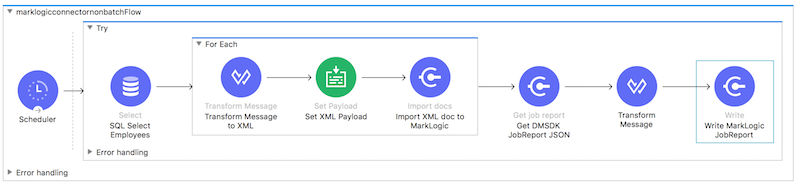

# Mulesoft Connector Extension for MarkLogic

## Example Flow: importDocs (Non-Batch Mode with XML Output)

_____________

### Overview ###

This flow demonstrates the importDocs operation, which has the following capabilities and constraints:

* Used to import content into MarkLogic via Data Movement SDK (DMSDK) and REST.
* Support for XML, JSON.  Text and Binary are supported too, if content bypasses any use of Mulesoft's Transform Message (Dataweave) transformers.  
* Support for the usual settings on MarkLogic's xdmp:document-insert() function: collections, permissions, quality, etc.  
* Persistence URIs can be customized, or have generated URI outputs.
* Support for server-side transforms.
* Returns a jobID, used to be able to fetch per-job reporting via the getJobReport operation.
* No support yet for ingest of RDF triples in common RDF serializations. 

### Flow Goals ###

1. Periodically make a call SQL SELECT call to a MySQL relational database to get a set of row data, for eventual ingestion into MarkLogic. 
2. Runs single threaded, transforming the row data to XML.
3. For each row, run it through the MarkLogic importDocs operation, to a DMSDK WriteBatch queue for asynchronous write into MarkLogic.  
4. Finally, get the DMSDK JobReport via getJobReport, convert it to XML, and write it to our local filesystem as well. 

### Flow Dependencies ###

In order to run this flow, which contains functionality that retrieves data from a MySQL database, you must add a dependency for MySQL, as it is used need for use with the Mulesoft Database Connector:

```
<dependency>
   <groupId>mysql</groupId>
   <artifactId>mysql-connector-java</artifactId>
   <version>5.1.44</version>
</dependency>
```

</img>


### Flow Steps ###

Here's what happens in the importDocs (using batch) example flow:

* Every 30 seconds, make a call SQL SELECT call to a MySQL relational database called "employees", that is <a href="https://github.com/datacharmer/test_db">storing human resources-related employee data</a>, and return those rows.  
  * We specifically use the employees table within the employees database, calling ```select * from employees```.  
  * The columns returned are *emp_no*, *birth_date*, *first_name*, *last_name*, *gender*, and *hire_date*.
* To keep our results small for now, the Mulesoft Database Connector will return 5 rows at a time, up to a maximum of 500 rows of data.
  * We define a single-threaded for-each scope to process the records..  
  * The key processing step uses a Dataweave 2.0 transform, via the Mulesoft Transform Message Component, to convert each row of data returned from our SQL SELECT call into a XML object (with XML-friendly, human-readable property names) representing the columns mentioned above.  We add some additional structure, nesting the object in an outer *employeeWrap* object , and add an *extractedDateTime* property.  See "Initial row-to-XML employee transform" below.
  * We use the Mulesoft Set Payload transformer to set the output of the transform as the payload for the importDocs operation.  This strips the *employeeWrap* element, yielding an *employee* element.  
  	* <i>N.B.: Be sure to set the "Encoding" to "ISO 10646/Unicode (UTF-8)", and the "MIME Type" "to "text/xml".</i>
  * The importDocs operation begins.  This uses DMSDK, with the user-defined settings for batch size and thread count.  We set the generateOutputUriBasename to *true*, so that we generate a random URI basename for persistence in MarkLogic.  
    * Since we're working with XML in this flow, make sure to set the *outputUriSuffix* to *".xml"*.  This actually helps DMSDK under the covers determine file type.
* Finally, run the MarkLogic operation getJobReport to get a JSON report of the current job status.  We add a transform to do a bit more enhancement, with conversion to XML, to prepare it for writing to the file system.  Finally, we write the enhanced JobReport XML out to our filesystem, based on the UUID we added to the data.  Notice the naming of the file, performing string concatenation for our final filename: ```#[payload.outcome.uuid ++ '.xml']```
  * See "DMSDK JobReport Transform" below.
  * Produces XML output to */tmp/6c1f0ff6-3cba-44fb-acde-6ee5bb0a098b.xml* thusly:

```
<?xml version='1.0' encoding='UTF-8'?>
<outcome>
  <message>
    <importResults>
      <jobID>24b2e8fb-6938-4939-828d-04d7f85ef24a</jobID>
      <jobOutcome>successful</jobOutcome>
      <successfulBatches>100</successfulBatches>
      <successfulEvents>500</successfulEvents>
      <failedBatches>0</failedBatches>
      <failedEvents>0</failedEvents>
      <jobName>import</jobName>
    </importResults>
    <exportResults/>
  </message>
  <jobID>import</jobID>
  <time>2018-09-26T19:06:20.539-04:00</time>
  <uuid>6c1f0ff6-3cba-44fb-acde-6ee5bb0a098b</uuid>
</outcome>
```


### Dataweave Transforms ###

#### Initial row-to-XML employee transform ####
```
%dw 2.0
output text/xml
---
{
	employeeWrap: {
		employee: using (myindex = vars.counter - 1) {
			employeeNumber: vars.rootMessage.payload[myindex].emp_no,
			hireDate: vars.rootMessage.payload[myindex].hire_date,
			firstName: vars.rootMessage.payload[myindex].first_name,
			lastName: vars.rootMessage.payload[myindex].last_name,
			birthDate: vars.rootMessage.payload[myindex].birth_date,
			gender: vars.rootMessage.payload[myindex].gender,
			extractedDateTime: now()
		}
	}
}
```

#### DMSDK JobReport Transform (to XML) ####
```
%dw 2.0
output text/xml
---
{outcome: {
        message: payload, 
        jobID: payload.importResults.jobName, 
        time: now(), 
        uuid: uuid()
    }
}
```


### Flow Designer Depiction ###

</img>

### Flow XML ###

Here is the Flow XML, also available <a href="project-mysql-importDocs-flow.xml">here</a>:


```
<?xml version="1.0" encoding="UTF-8"?>
<mule xmlns:file="http://www.mulesoft.org/schema/mule/file" xmlns:marklogic="http://www.mulesoft.org/schema/mule/marklogic"
    xmlns:ee="http://www.mulesoft.org/schema/mule/ee/core"
    xmlns:db="http://www.mulesoft.org/schema/mule/db" xmlns="http://www.mulesoft.org/schema/mule/core" xmlns:doc="http://www.mulesoft.org/schema/mule/documentation" xmlns:xsi="http://www.w3.org/2001/XMLSchema-instance" xsi:schemaLocation="http://www.mulesoft.org/schema/mule/core http://www.mulesoft.org/schema/mule/core/current/mule.xsd
    http://www.mulesoft.org/schema/mule/db http://www.mulesoft.org/schema/mule/db/current/mule-db.xsd
    http://www.mulesoft.org/schema/mule/ee/core http://www.mulesoft.org/schema/mule/ee/core/current/mule-ee.xsd
    http://www.mulesoft.org/schema/mule/marklogic http://www.mulesoft.org/schema/mule/marklogic/current/mule-marklogic.xsd
    http://www.mulesoft.org/schema/mule/file http://www.mulesoft.org/schema/mule/file/current/mule-file.xsd">
    <db:config name="Database_Config" doc:name="Database Config" doc:id="597f55a7-efa1-4c7e-af48-b7cf9da5707c" >
        <db:my-sql-connection host="***REMOVED***" port="3306" user="mulesoft" password="***REMOVED***" database="employees" />
    </db:config>
    <marklogic:config name="MarkLogic_Config" doc:name="MarkLogic Config" doc:id="31ee9cb1-8eeb-4b2b-8c3e-7f138e2fd0a7" threadCount="3" batchSize="5" secondsBeforeFlush="2" jobName="import" configId="testConfig-223efe">
        <marklogic:connection hostname="***REMOVED***" username="mulesoft" password="***REMOVED***" port="8010" authenticationType="digest" connectionId="testConfig-223efe"/>
    </marklogic:config>
    <file:config name="File_Config" doc:name="File Config" doc:id="b7e95b75-492c-4f7f-9a2e-6bd13bc1739f" >
        <file:connection workingDir="/tmp/" />
    </file:config>
    <flow name="marklogicconnectornonbatchFlow" doc:id="153dfd12-959a-4015-998e-58256ec30a65" >
        <scheduler doc:name="Scheduler" doc:id="3a3d35e9-e090-437a-b7b7-7ed658e29e2a" >
            <scheduling-strategy >
                <fixed-frequency frequency="30000"/>
            </scheduling-strategy>
        </scheduler>
        <try doc:name="Try" doc:id="66a57184-186e-4937-b9e3-0baa7c0d71cc" >
            <db:select doc:name="SQL Select Employees" doc:id="7a462ee9-2cd0-44c2-af1b-10117bfc3fa3" config-ref="Database_Config" fetchSize="5" maxRows="500">
                <ee:repeatable-file-store-iterable />
                <db:sql >select * from employees;</db:sql>
            </db:select>
            <foreach doc:name="For Each" doc:id="4ce0ee15-e188-4017-949c-2d538b3548f2" >
                <ee:transform doc:name="Transform Message to XML" doc:id="53f82a37-fddc-4779-b8ef-5327fb27d5e9" >
                    <ee:message >
                        <ee:set-payload ><![CDATA[%dw 2.0
output text/xml
---
{
	employeeWrap: {
		employee: using (myindex = vars.counter - 1) {
			empNo: vars.rootMessage.payload[myindex].emp_no,
			hireDate: vars.rootMessage.payload[myindex].hire_date,
			firstName: vars.rootMessage.payload[myindex].first_name,
			lastName: vars.rootMessage.payload[myindex].last_name,
			birthDate: vars.rootMessage.payload[myindex].birth_date,
			gender: vars.rootMessage.payload[myindex].gender,
			extractedDateTime: now()
		}
	}
}]]></ee:set-payload>
                    </ee:message>
                </ee:transform>
                <set-payload value="#[payload.employeeWrap]" doc:name="Set XML Payload" doc:id="79dee645-c830-48c8-bae9-a787bbe409d9" encoding="UTF-8" mimeType="text/xml"/>
                <marklogic:import-docs doc:name="Import XML doc to MarkLogic" doc:id="563cd048-4c75-49a7-9b1b-1da8adebb9c1" 
                    config-ref="MarkLogic_Config" docPayloads="#[payload]" 
                    outputCollections="mulesoft-dmsdk-test,mulesoft-dmsdk-test-xml"
                    outputQuality="2"
                    outputUriPrefix="/mulesoft/" outputUriSuffix=".xml"
                    basenameUri="null" 
                    generateOutputUriBasename="true"/>
            </foreach>
            <marklogic:get-job-report doc:name="Get DMSDK JobReport JSON" doc:id="8be11287-bb60-4821-9149-ab265f52aa9a" />
            <ee:transform doc:name="Transform Message" doc:id="9d887377-0f74-4a42-b966-8892423fabb4" >
                <ee:message >
                    <ee:set-payload ><![CDATA[%dw 2.0
output text/xml
---
{outcome: {
		message: payload, 
		jobID: payload.importResults.jobName, 
		time: now(), 
		uuid: uuid()
	}
}]]></ee:set-payload>
                </ee:message>
            </ee:transform>
            <file:write doc:name="Write MarkLogic JobReport" doc:id="0d3ba823-bfaf-4ce5-9c88-9a782b528ef3" config-ref="File_Config" path="#[payload.outcome.uuid ++ '.xml']"/>
        </try>
    </flow>
</mule>
```